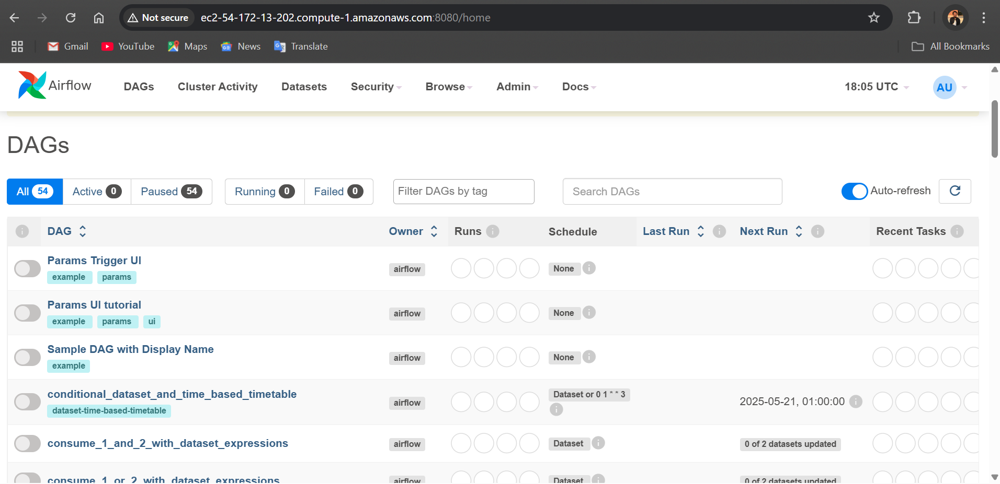
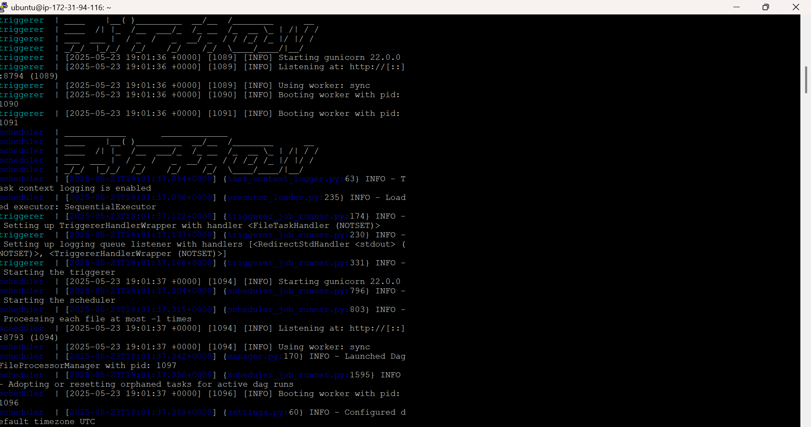
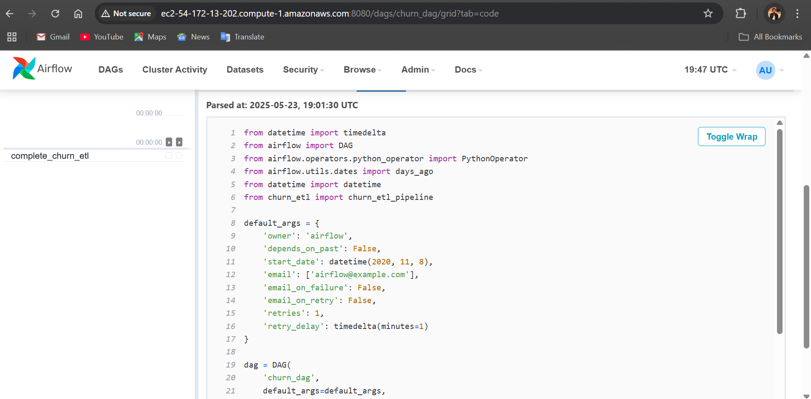
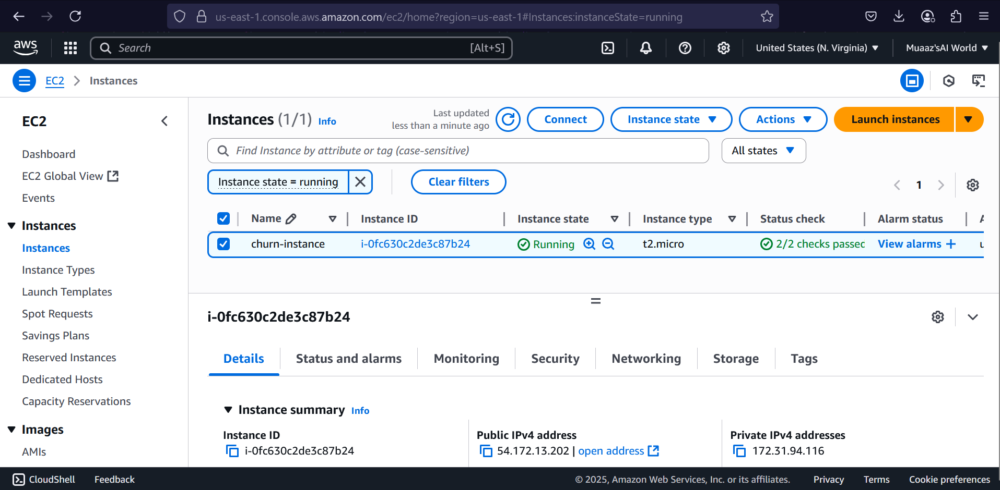
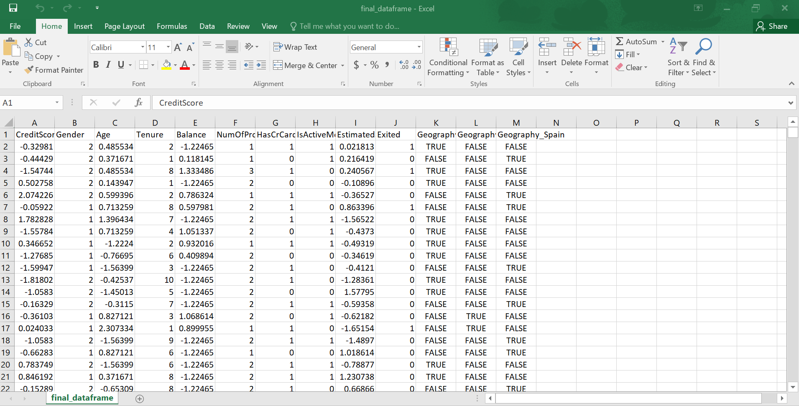
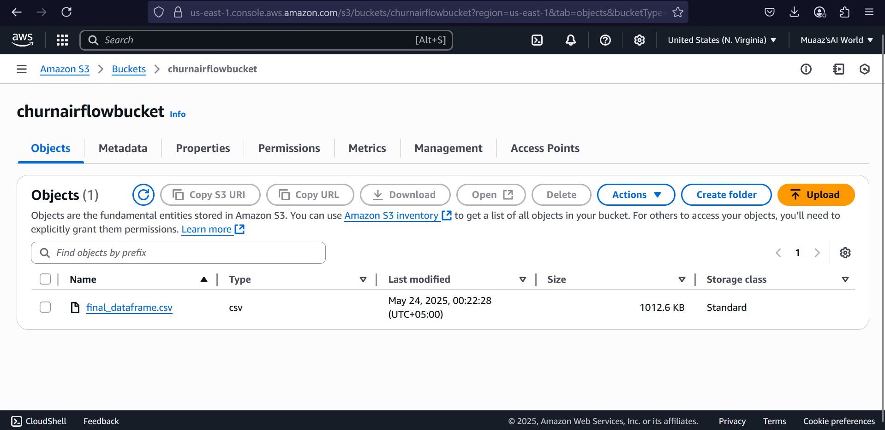

# Airflow ETL Pipeline Project using AWS

This project demonstrates how to create and run an ETL (Extract, Transform, Load) pipeline using **Apache Airflow**. The DAG (`churn_dag.py`) runs a basic workflow for churn data processing, orchestrated through the Airflow UI, and deployed using **AWS EC2** and **S3**. Screenshots are included to visually support each step of the process.

---

## 🛠 Project Structure

| File Name          | Description                                                |
|--------------------|------------------------------------------------------------|
| `churn_dag.py`     | Defines the ETL DAG (Directed Acyclic Graph) for Airflow.  |
| `churn_etl.py`     | Contains the Python code to perform extract, transform, and load operations. |

---

## Airflow Dashboard

This screenshot shows the DAG in the Airflow dashboard after being successfully deployed and triggered.

---

## Terminal Output

This screenshot captures the CLI (command-line interface) output from the Airflow terminal while running the DAG.

---

## Source Code

Here is a snapshot of the DAG and ETL code shown in the development environment.

---

## AWS EC2 Instance

Screenshot of the AWS EC2 instance where Airflow was hosted. The EC2 console shows instance details such as status and type.

---

## Final Output Data

This screenshot shows the processed churn data (after ETL) saved locally or sent to S3 for storage.

---

## AWS S3 Bucket

Depicts the S3 bucket used to store intermediate or final output from the ETL pipeline.

---
---

## 📬 Contact

For any queries or suggestions, feel free to open an issue or reach out on LinkedIn.

